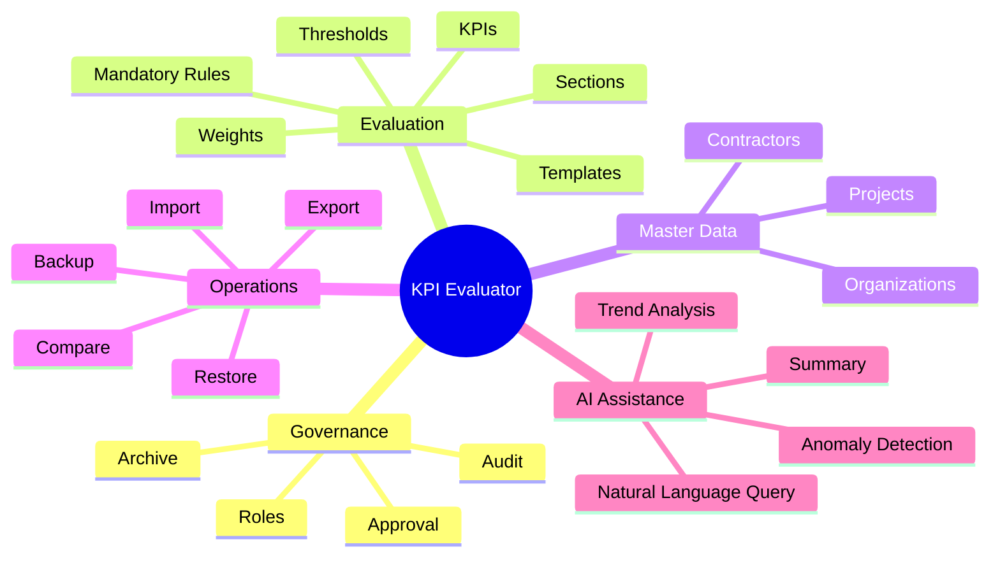
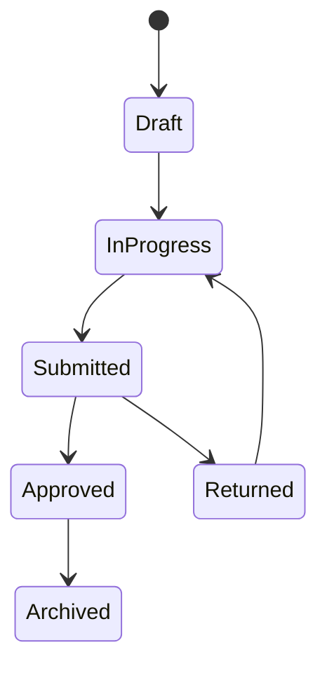

# KPI Evaluator — Architecture Notes

## Functional domains

## Separation of concerns

The product is easier to maintain when split into distinct layers:

1. **Presentation layer** — forms, dashboards, evaluation screens.
2. **Application layer** — workflows, permissions, orchestration.
3. **Domain layer** — KPI scoring, validation rules, approval state.
4. **Persistence layer** — users, templates, evaluations, audit history.
5. **Integration layer** — SMTP, file import/export, optional AI providers.

## Suggested entities

- User
- Role
- Organization
- Contractor
- Project
- EvaluationTemplate
- EvaluationSection
- KPI
- Evaluation
- EvaluationItem
- Evidence
- Approval
- AuditLog
- ExportJob
- AIConfiguration

## Governance states

