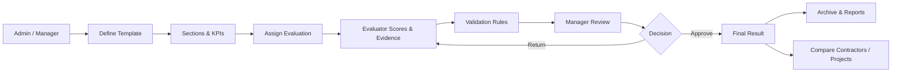
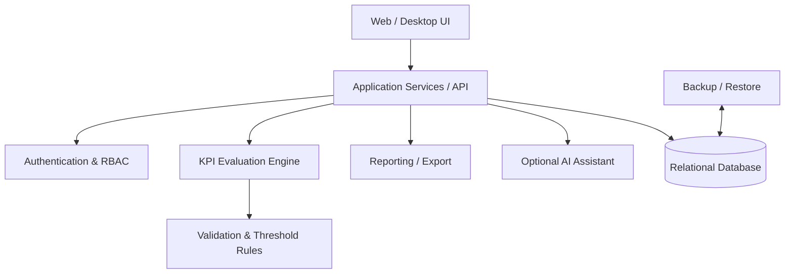

# KPI Evaluator — Public Showcase

A public, sanitized showcase of an organizational **KPI evaluation and performance-management platform** designed for contractor qualification, compliance checks, acceptance workflows, and performance assessment.

> This repository section is a portfolio showcase only. Production source code, organizational data, credentials, internal infrastructure details, and sensitive business rules are intentionally excluded.

## Why this project exists

Organizations often evaluate contractors, projects, suppliers, or operational units through spreadsheets, disconnected forms, and subjective review processes. The goal of KPI Evaluator is to replace that fragmented workflow with a structured platform that supports:

- reusable KPI templates;
- mandatory and weighted criteria;
- evaluator workflows;
- manager approval;
- contractor/project comparison;
- auditability;
- archival history;
- reporting and future AI-assisted analysis.

## Core workflow

## User roles

| Role | Main responsibility |
|---|---|
| Manager | Final approval, governance, configuration, oversight |
| Evaluator | Scores KPIs, submits evidence and evaluation results |
| Viewer | Read-only access to authorized reports and results |
| Contractor | Limited access to relevant evaluation information where applicable |

## Key capabilities

- Template, section, and KPI CRUD
- Mandatory KPI enforcement
- Configurable passing threshold
- Weighted scoring
- Multi-contractor import and comparison
- Evaluation submission and manager approval workflow
- Archive instead of destructive deletion
- Role-based access
- Project / organization / contractor master data
- Export and reporting
- Password recovery through email verification
- AI configuration and status visibility
- Backup / restore / factory-reset operations
- Seed/demo environment for repeatable testing

## Example decision model

A typical evaluation policy can combine:

- **overall threshold** — e.g. minimum total score;
- **mandatory requirements** — must pass regardless of aggregate score;
- **weighted criteria** — different importance levels;
- **manager approval** — human review remains the final gate.

This allows the platform to support both quantitative scoring and governance requirements.

## Architecture concept

## Operational design principles

### 1. Configurable rather than hard-coded
Organizations should be able to change templates, sections, KPIs, thresholds, and evaluation structures without rebuilding the application.

### 2. Human approval remains explicit
AI or automation may assist with analysis, anomaly detection, or summarization, but final organizational approval stays with authorized users.

### 3. Auditability
Important actions should be traceable: who evaluated, who approved, what changed, and when.

### 4. Safe deletion
Business records are archived where possible instead of being permanently deleted.

### 5. Deployable in constrained environments
The system is designed with organizational environments in mind, including on-premise or restricted-network deployment.

## Technology direction

The project has been designed around a pragmatic organizational stack, including:

- Python
- Web application architecture
- Relational database
- Docker-based deployment
- SMTP-based account recovery
- Role-based access control
- Offline / online AI configuration options

The exact production stack may evolve depending on deployment constraints and integration requirements.

## AI-ready extensions

Potential AI-assisted capabilities include:

- evaluation-summary generation;
- anomaly detection across contractor scores;
- evidence completeness checks;
- trend analysis;
- risk flagging;
- explanation of score differences;
- natural-language queries over evaluation history.

AI is treated as an **assistive layer**, not as an autonomous approval authority.

## Example evaluation lifecycle

1. Manager creates or selects an evaluation template.
2. Project and contractor are assigned.
3. Evaluator completes KPI scoring and evidence.
4. Validation rules check mandatory items and thresholds.
5. Evaluator submits.
6. Manager reviews and approves or returns the evaluation.
7. Final result is archived and becomes available for reporting and comparison.

## Portfolio boundaries

The public showcase intentionally excludes:

- production credentials;
- real contractor names and confidential performance data;
- internal organizational network details;
- proprietary documents;
- sensitive scoring rules;
- private source code.

Demo names and synthetic examples should be used in all public screenshots and documentation.

## Next showcase improvements

- Add sanitized UI screenshots
- Add a sample evaluation template
- Add a demo dashboard
- Add a sample contractor-comparison report
- Add a deployment diagram
- Add a short product walkthrough

---

**Portfolio project by Farhad Zandi**
